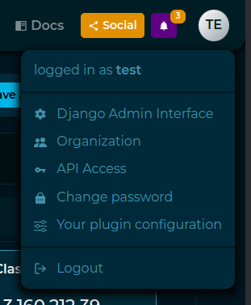

# PyIntelOwl

[](https://badge.fury.io/py/pyintelowl)
[](https://pypi.python.org/pypi/pyintelowl/)

[](https://github.com/intelowlproject/pyintelowl/actions/workflows/pull_request_automation.yml)
[](https://codecov.io/gh/intelowlproject/pyintelowl)
[](https://www.codefactor.io/repository/github/intelowlproject/pyintelowl)

Robust Python **SDK** and **Command Line Client** for interacting with [IntelOwl](https://github.com/intelowlproject/IntelOwl)'s API.

## Features

- Easy one-time configuration with self documented help and hints along the way.
- Request new analysis for observables and files.
  - Select which analyzers you want to run for every analysis you perform.
  - Choose whether you want to HTTP poll for the analysis to finish or not.
- List all jobs or view one job in a prettified tabular form.
- List all tags or view one tag in a prettified tabular form.

## Demo

[](https://asciinema.org/a/z7L93lsIzOQ0Scve7hMl30mJJ?t=5)

## Installation

```bash
$ pip3 install pyintelowl
```

For development/testing, `pip3 install pyintelowl[dev]`

## Quickstart

### As Command Line Client

On successful installation, The `pyintelowl` entryscript should be directly invokable. For example,

```bash
$ pyintelowl
Usage: pyintelowl [OPTIONS] COMMAND [ARGS]...

Options:
  -d, --debug  Set log level to DEBUG
  --version    Show the version and exit.
  -h, --help   Show this message and exit.

Commands:
  analyse                Send new analysis request
  analyzer-healthcheck   Send healthcheck request for an analyzer...
  config                 Set or view config variables
  connector-healthcheck  Send healthcheck request for a connector
  jobs                   Manage Jobs
  tags                   Manage tags
```

### As a library / SDK

```python
from pyintelowl import IntelOwl
obj = IntelOwl("<your_api_key>", "<your_intelowl_instance_url>", "optional<path_to_pem_file>", "optional<proxies>")
```

For more comprehensive documentation, please see https://intelowlproject.github.io/docs/pyintelowl/.

## Changelog

View [CHANGELOG.md](https://github.com/intelowlproject/pyintelowl/blob/master/.github/CHANGELOG.md).


## How to generate an API key

You need a valid API key to interact with the IntelOwl server.
Keys can be created from the "API access" section of the user's menu in the IntelOwl's GUI.



Otherwise, you can create them from the Django Admin Interface of the IntelOwl application with an administration account. Section "Durin" -> "Auth tokens"
